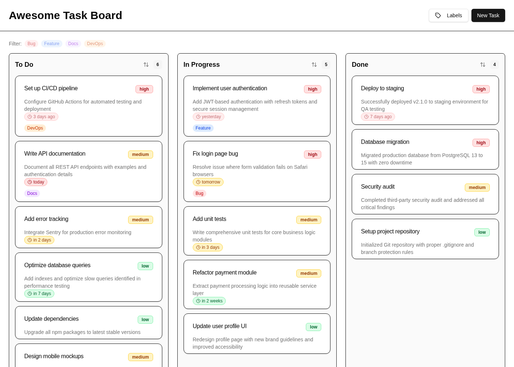
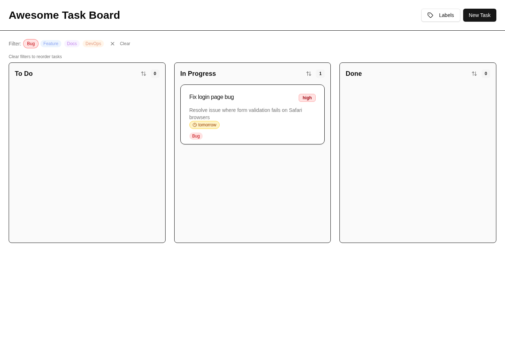
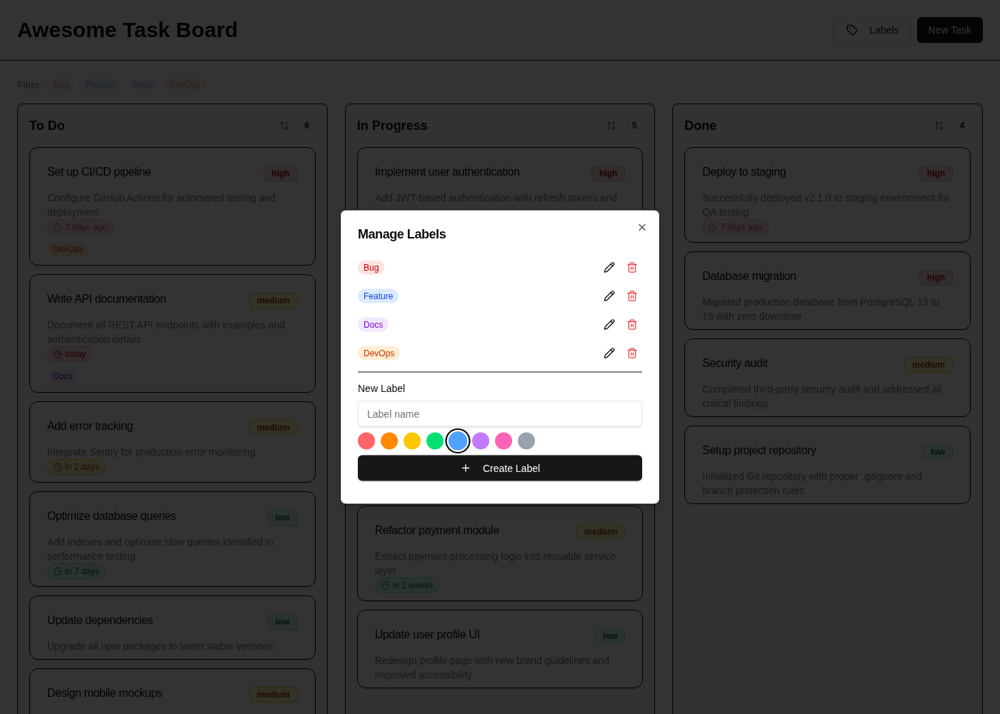
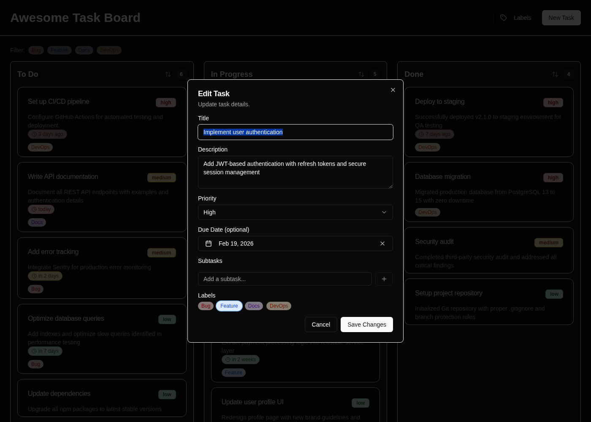
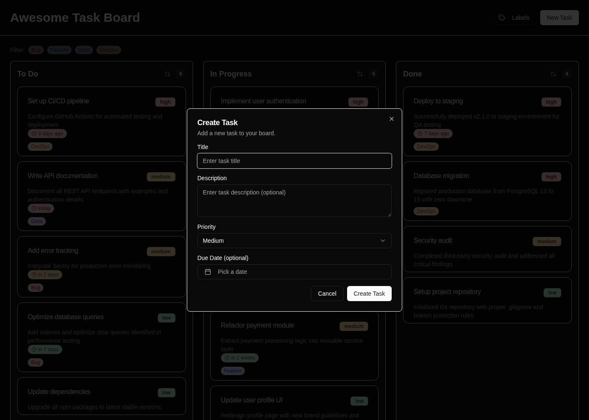

<p align="center">
  
</p>

<h1 align="center">Claude Pilot Demo</h1>

<p align="center">
  A full-featured Kanban task board — built and extended entirely by AI using <a href="https://github.com/maxritter/claude-pilot">Claude Pilot</a>.<br>
  Start a task, grab a coffee, come back to production-grade code.
</p>

<p align="center">
  <a href="https://github.com/maxritter/claude-pilot"></a>
  <a href="https://github.com/maxritter/claude-pilot"></a>
</p>

---

## What Is This?

This repository is a **live demo** of what [Claude Pilot](https://github.com/maxritter/claude-pilot) can do. It showcases an Awesome Task Board app that was:

1. **Created from scratch** with a single prompt — full Kanban board with drag-and-drop, CRUD, SQLite persistence
2. **Extended with 3 features in parallel** — each one-shotted by Claude Pilot's `/spec` command, built simultaneously in isolated git worktrees

**Zero manual intervention.** No hand-tuning, no manual bug fixing, no code edits by a human. The initial prompt produced the complete working app. Each of the three feature prompts was one-shotted by Claude Pilot — plan, implement, test, verify, merge — with no human involvement beyond approving the plan. The 3 features were built in parallel using git worktrees, each on its own isolated branch, and squash-merged to main after automated verification passed.

Every line of code — from database schema to UI components to tests — was planned, implemented, and verified entirely by AI. Even this README, the screenshots, and the repository setup were created by Claude Pilot.

> **Claude Code is powerful. Pilot makes it reliable.**
> Tests enforced. Context preserved. Quality automated.

## The Demo

<p align="center">
  <a href="https://youtu.be/S7faAK931NU">
    
  </a>
</p>

<p align="center">
  <a href="https://youtu.be/S7faAK931NU"><b>Watch the full demo on YouTube</b></a>
</p>

This demo was recorded live and shows all three features being built in real-time using Claude Pilot's `/spec` workflow — each one-shotted with zero manual code edits:

- `/spec` plans the feature, explores the codebase, writes a detailed spec
- After human approval, it implements with strict TDD (red-green-refactor)
- Automated verification: type checking, linting, tests, code review agents, E2E testing
- All 3 features built **in parallel** using git worktrees — each on its own isolated branch, merged to main after verification

## Features

### Core Board (Initial Prompt)

- Three-column Kanban: **To Do**, **In Progress**, **Done**
- Drag-and-drop task cards with optimistic UI (no flicker)
- Create, edit, delete tasks with modal dialogs
- Color-coded priority badges (High / Medium / Low)
- Task count on each column header
- SQLite persistence with auto-seeding of 15 sample tasks

### Feature 1: Colorful Labels & Filtering

Create labels with custom names and a 10-color palette. Assign multiple labels to any task. Filter the board by clicking label pills — only matching tasks are shown. Full label management UI with create, edit, and delete.

<p align="center">
  
</p>

<p align="center">
  
</p>

### Feature 2: Subtasks with Progress Tracking

Add checklist items to any task. Toggle subtasks complete/incomplete. A compact progress bar on each task card shows completion status — gray (0%), blue (partial), green (100%).

<p align="center">
  
</p>

### Feature 3: Due Dates with Smart Urgency Indicators

Optional due date with a calendar picker. Relative time labels: "in 5 days", "tomorrow", "today", "yesterday", "3 days ago". Color-coded urgency badges — green (>3 days), amber (1-3 days), red (overdue) with a pulsing animation. Per-column sort-by-due-date toggle.

<p align="center">
  
</p>

---

## The Prompts

### Initial Project Prompt

The entire base application was created from this single prompt:

> Build a Kanban task board app using Next.js (App Router), SQLite (via Drizzle ORM + better-sqlite3), Tailwind CSS with shadcn/ui components, and @hello-pangea/dnd for drag-and-drop.
>
> Single-page task board with three columns: To Do, In Progress, Done. Users can:
>
> - Drag and drop task cards between columns (optimistic UI, no flicker)
> - Create new tasks (title, description, priority: Low/Medium/High)
> - Edit existing tasks via a modal dialog
> - Delete tasks with confirmation dialog
> - See task count badges on each column header
>
> Each task card shows: title, truncated description (2 lines), and a color-coded priority badge (red=High, amber=Medium, green=Low).
>
> Use Next.js Server Actions for all CRUD operations. SQLite database with a single "tasks" table (id, title, description, priority, status, position, created_at). Seed ~15 sample tasks on first run.
>
> UI: shadcn/ui Card, Dialog, AlertDialog, Button, Badge, Input, Select, Label, Textarea. Sonner for toast notifications.

### Feature Prompts (via `/spec`)

Each feature was added using Claude Pilot's `/spec` command. Behind the scenes, `/spec` plans the implementation, runs adversarial plan review, gets human approval, implements with TDD, and verifies everything — all in isolated git worktrees.

You can browse the full implementation plans that Claude Pilot generated and executed — they're included in this repo:

- [Initial Board Plan](docs/plans/2026-02-13-kanban-task-board.md)
- [Labels/Tags Plan](docs/plans/2026-02-20-labels-tags-system.md)
- [Subtasks/Checklist Plan](docs/plans/2026-02-20-subtasks-checklist-system.md)
- [Due Dates Plan](docs/plans/2026-02-20-add-due-dates.md)

<details>
<summary><b>Feature 1: Colorful Labels/Tags System</b></summary>

```
/spec Add a colorful labels/tags system to the task board. Users should be able to
create labels with a name and a color (provide a predefined palette of 8-10 colors
to choose from), assign multiple labels to any task, and remove labels from tasks.
Labels should appear as small colored pills on the task cards. Add a filter bar above
the board columns that lets users filter tasks by clicking on label pills - when a
label filter is active, only tasks with that label are shown. Include a label management
UI accessible from the header where users can create, edit, and delete labels. New
database tables needed: a labels table (id, name, color) and a task_labels junction
table (taskId, labelId). Write tests for all server actions and verify the UI works
end to end with playwright-cli.
```

</details>

<details>
<summary><b>Feature 2: Subtasks with Progress Tracking</b></summary>

```
/spec Add a subtasks/checklist system with visual progress tracking. Each task can
have multiple subtasks (simple text items with a completed boolean). In the edit task
dialog, add a checklist section where users can add new subtask items, toggle them
complete/incomplete with checkboxes, delete individual subtasks, and reorder them by
drag and drop. On the task card face in the board view, show a compact progress
indicator when subtasks exist - a small progress bar with a label like "3/5" showing
completed vs total count. The progress bar should be color-coded (gray when 0%, blue
when partially complete, green when 100%). New database table needed: subtasks (id,
taskId, title, completed, position). Write tests for all server actions and verify
the UI works end to end with playwright-cli.
```

</details>

<details>
<summary><b>Feature 3: Due Dates with Smart Urgency Indicators</b></summary>

```
/spec Add due dates to tasks with smart visual urgency indicators. Add an optional
due date field to the tasks table. In the create and edit task dialogs, add a date
picker component for selecting due dates (with a clear button to remove the date).
On task cards, display the due date as a relative time label: "in 5 days", "tomorrow",
"today", "yesterday", "3 days ago" etc. Color-code the due date indicator based on
urgency: green when more than 3 days away, amber/yellow when 1-3 days away, red when
overdue, and a subtle pulsing animation on the red overdue badge to draw attention.
Tasks with no due date should show nothing. Add the ability to sort tasks within a
column by due date (soonest first) via a sort toggle button on each column header.
Write tests for all server actions and verify the UI works end to end with
playwright-cli.
```

</details>

---

## What Claude Pilot Did (Automatically)

For each `/spec` command, Claude Pilot automatically:

| Step          | What Happens                                                                                                                              |
| ------------- | ----------------------------------------------------------------------------------------------------------------------------------------- |
| **Plan**      | Explores the codebase with semantic search, designs the implementation, writes a detailed task-by-task plan with definitions of done      |
| **Review**    | Adversarial plan-challenger and plan-verifier agents independently review the plan for gaps, missing edge cases, and architectural issues |
| **Approve**   | Presents the plan for human review — the only manual step                                                                                 |
| **Implement** | Strict TDD for each task (red-green-refactor). Quality hooks auto-lint, format, and type-check every file edit                            |
| **Verify**    | Code review agents, type checking, linting, build verification, E2E testing with Playwright, and execution verification                   |
| **Merge**     | Each feature developed in an isolated git worktree, squash-merged to main after verification passes                                       |

All 3 features were built in parallel — each in its own git worktree on a dedicated branch. No conflicts, no coordination needed. When verification passed, each worktree was squash-merged to main as a single clean commit.

**Result:** Clean TypeScript, zero lint errors, verified E2E — zero manual code edits, zero bug fixes by a human.

---

## Tech Stack

| Layer           | Technology                              |
| --------------- | --------------------------------------- |
| Framework       | Next.js 16 (App Router)                 |
| Language        | TypeScript                              |
| Database        | SQLite via better-sqlite3 + Drizzle ORM |
| UI Components   | shadcn/ui (Radix UI) + Tailwind CSS v4  |
| Drag & Drop     | @hello-pangea/dnd                       |
| Toasts          | Sonner                                  |
| Testing         | Vitest                                  |
| Package Manager | Yarn                                    |

---

## Try Claude Pilot

Want to build something like this yourself? Claude Pilot works with **any existing project** — install it, run `/sync` to learn your codebase, then use `/spec` to plan and implement features with full TDD and automated verification.

```bash
curl -fsSL https://raw.githubusercontent.com/maxritter/claude-pilot/main/install.sh | bash
```

**[Claude Pilot on GitHub](https://github.com/maxritter/claude-pilot)** — Structured spec-driven development for Claude Code with TDD, automated verification, and git worktree isolation.

---

## Workshops & Enterprise Adoption

Claude Pilot is built by [Max Ritter](https://www.maxritter.net/), a senior IT freelancer and consultant from Germany. Max helps companies and enterprises adopt Claude Code and Claude Pilot for production-grade AI-assisted development.

**What's on offer:**

- **Agentic Engineering Workshops** — Hands-on training for development teams on Claude Code, Claude Pilot, and spec-driven AI development
- **Enterprise Rollout** — Guidance on introducing and rolling out Claude Pilot across your organization, including custom rules, team vaults, and quality guardrails
- **Consulting** — Architecture reviews, workflow optimization, and best practices for AI-assisted development at scale

**Get in touch:** [mail@maxritter.net](mailto:mail@maxritter.net)
